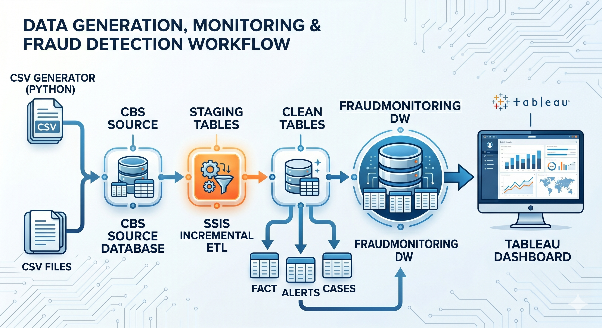
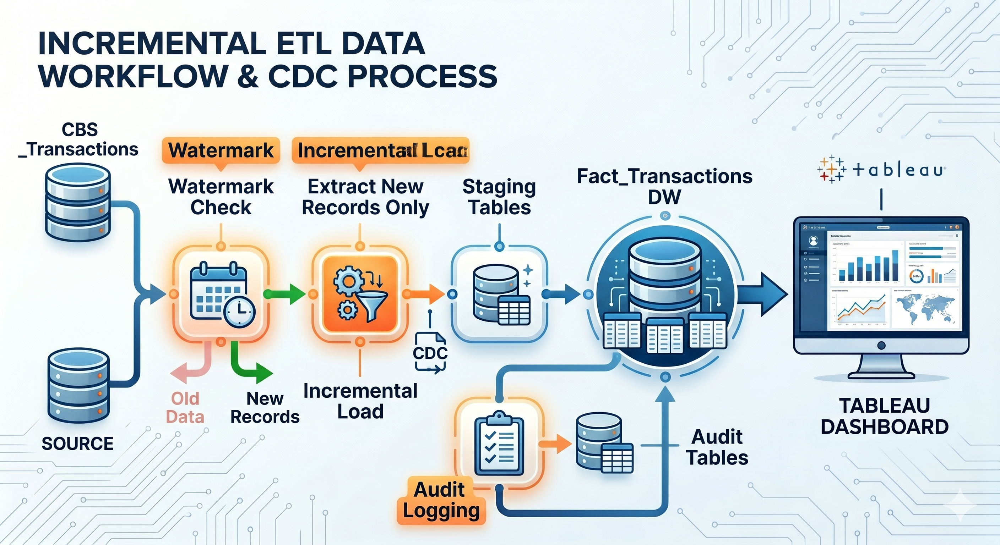

# Incremental ETL Fraud Monitoring System

A production-style Data Engineering and Fraud Analytics project that demonstrates incremental ETL processing, fraud detection, case management, audit logging, and interactive business intelligence dashboards using SQL Server, SSIS, Python, and Tableau.

---

## Project Overview

This project simulates a real-world banking fraud monitoring platform that continuously ingests transaction data, performs fraud analysis, generates alerts, creates investigation cases, and provides operational dashboards for analysts.

The system uses Incremental ETL with Watermarking and CDC concepts to process only newly arrived transactions, reducing unnecessary data movement and improving scalability.

---

## Business Problem

Financial institutions process millions of transactions daily.

Traditional full-load ETL approaches become inefficient because they:

- Reprocess already loaded data
- Increase execution time
- Consume unnecessary resources
- Delay fraud detection

This project solves the problem using Incremental ETL techniques and automated fraud detection workflows.

---

## Key Features

### Data Engineering

- Incremental ETL using SSIS
- Watermark-based extraction
- Change Data Capture (CDC) simulation
- Staging and Data Warehouse architecture
- ETL Audit Logging
- ETL Execution Tracking
- Rejected Transaction Handling

### Fraud Detection Engine

- Dynamic Risk Scoring
- Fraud Flag Generation
- Fraud Severity Classification
- Automated Fraud Alert Generation
- Automated Fraud Case Creation
- SLA Tracking
- Case Escalation Logic

### Analytics & Reporting

- Fraud Trend Analysis
- Fraud Severity Distribution
- Fraud by Transaction Type
- Fraud by Location
- Analyst Workload Monitoring
- Case Status Tracking
- Alert Timeline Monitoring
- Executive KPI Dashboard

---

## Technology Stack

| Component | Technology |
|------------|------------|
| Database | SQL Server |
| ETL | SQL Server Integration Services (SSIS) |
| Programming | Python |
| Data Generation | Faker |
| Reporting | Tableau |
| Version Control | Git & GitHub |

---

## System Architecture

```text
Python Transaction Generator
            │
            ▼
CBS Source Database
            │
            ▼
Incremental ETL (SSIS)
            │
            ▼
FraudMonitoringDW
            │
    ┌───────┼────────┐
    ▼       ▼        ▼
Fact      Alerts    Cases
Table     Table     Table
    │
    ▼
Tableau Dashboard
```

---

## Project Structure

```text
Incremental_ETL_Fraud_Monitoring_System
│
├── README.md
├── LICENSE
├── .gitignore
│
├── 01_Database
│   └── Master_Database_Setup.sql
│
├── 02_ETL
│   ├── Master_ETL_Setup.sql
│   ├── Incremental_Extract.dtsx
│   └── Master_ETL.dtsx
│
├── 03_Fraud_Engine
│   └── Master_Fraud_Engine.sql
│
├── 04_Analytics
│   └── Analytics_Queries.sql
│
├── 05_Python_Generator
│   ├── Live_Transaction_Generator.py
│   └── requirements.txt
│
├── 06_Tableau
│   └── Enterprise_Fraud_Command_Center.twbx
│
├── 07_Documentation
│
└── 08_Sample_Data
```

---

## Database Components

### Source System

- CBS_Transactions

### Data Warehouse

- Fact_Transactions
- Fraud_Alerts
- Fraud_Cases
- ETL_Watermark
- ETL_Audit_Log
- ETL_Execution_Log

---

## Incremental ETL Workflow

### Step 1 – Watermark Validation

The ETL process retrieves the latest successful load timestamp from the ETL_Watermark table.

### Step 2 – Incremental Extraction

Only transactions newer than the watermark are extracted from the source system.

### Step 3 – Staging

New records are loaded into the staging layer.

### Step 4 – Warehouse Load

Validated records are loaded into Fact_Transactions.

### Step 5 – Audit Logging

Load statistics are stored in ETL_Audit_Log and ETL_Execution_Log.

### Step 6 – Watermark Update

The watermark is updated to the latest processed transaction timestamp.

---

## Fraud Detection Logic

### Risk Score Calculation

Risk scores are generated using transaction characteristics such as:

- Transaction Amount
- Transaction Status
- Transaction Type
- Device Risk Indicators
- Location Risk Indicators

### Fraud Classification

| Risk Score | Severity |
|------------|-----------|
| 90+ | Critical |
| 70-89 | High |
| 50-69 | Medium |
| Below 50 | Low |

### Fraud Alert Generation

Transactions exceeding the configured risk threshold automatically generate alerts.

### Fraud Case Creation

Alerts automatically create investigation cases and assign analysts based on severity.

---

## Dashboard KPIs

The Tableau dashboard provides:

### Executive KPIs

- Total Transactions
- Fraud Transactions
- Fraud Percentage
- Active Fraud Alerts
- Open Fraud Cases
- Escalated Cases

### Operational Analytics

- Fraud Trend Over Time
- Fraud Severity Distribution
- Fraud by Transaction Type
- Fraud by Location
- Analyst Workload Distribution
- Case Status Distribution
- Fraud Alert Timeline

---

## Dashboard Preview

### Main Dashboard


### Architecture



### ETL Flow



---

## Sample Results

| Metric | Value |
|---------|---------|
| Total Transactions | 20,000 |
| Fraud Transactions | 5,853 |
| Fraud Percentage | 29.27% |
| Fraud Alerts | 5,853 |
| Fraud Cases | 11,706 |

---

## How To Run

### 1. Database Setup

Execute:

```sql
Master_Database_Setup.sql
```

### 2. Configure ETL

Deploy and execute:

```text
Incremental_Extract.dtsx
Master_ETL.dtsx
```

### 3. Generate Transactions

Run:

```bash
python Live_Transaction_Generator.py
```

### 4. Execute Fraud Engine

Execute:

```sql
Master_Fraud_Engine.sql
```

### 5. Open Dashboard

Open:

```text
Enterprise_Fraud_Command_Center.twbx
```

Refresh the data source and explore the dashboard.

---

## Future Enhancements

- Real-time Streaming using Kafka
- Azure Data Factory Integration
- Power BI Dashboard Version
- Machine Learning Fraud Detection
- Real-time Alert Notifications
- REST API Integration
- Cloud Deployment on Azure

---

## Learning Outcomes

This project demonstrates:

- Data Warehousing
- Incremental ETL Design
- Change Data Capture Concepts
- SQL Performance Optimization
- Fraud Detection Workflows
- Tableau Dashboard Development
- End-to-End Data Engineering Architecture

---

## Author

Soham

Bachelor of Technology (Computer Science)

Data Engineering | Business Intelligence | Analytics

---

## License

This project is licensed under the MIT License.
